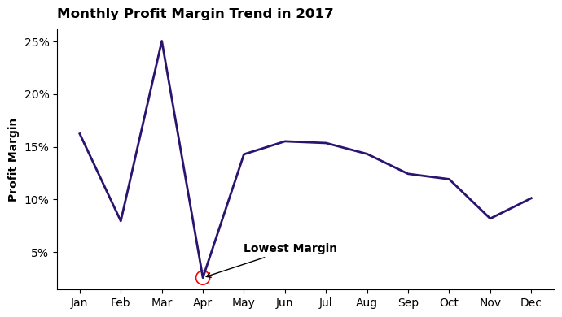
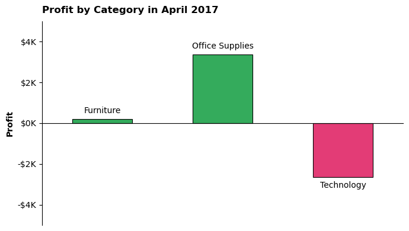
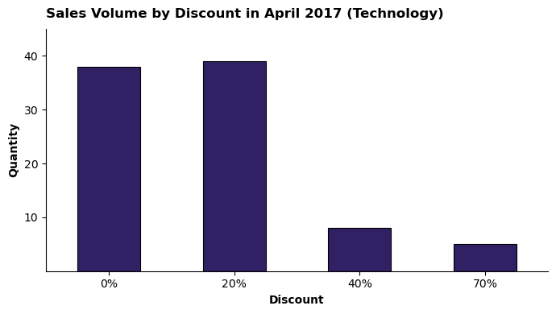
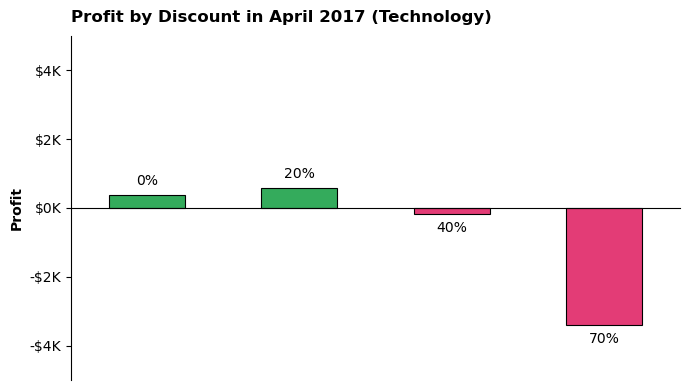

# Analisis Peran Diskon pada Bulan dengan Profit Margin Terendah

# Ringkasan

Dalam industri retail, pemberian diskon sering digunakan untuk meningkatkan penjualan. Namun, strategi ini juga dapat memengaruhi profitabilitas apabila tidak dikelola dengan tepat. Proyek ini menggunakan data [Superstore](https://www.kaggle.com/datasets/vivek468/superstore-dataset-final) untuk mengidentifikasi bulan dengan profit margin terendah serta menganalisis peran diskon terhadap profit margin pada bulan tersebut. Melalui serangkaian proses persiapan dan analisis data, diperoleh beberapa insight yang dapat dijadikan bahan evaluasi bagi perusahaan.

# Tujuan

1. Mengidentifikasi bulan dengan profit margin terendah.
2. Menganalisis peran diskon terhadap profit margin pada bulan tersebut.

# Rumusan Masalah

1. Bulan apa yang memiliki profit margin terendah?
2. Apakah terdapat kategori dengan profit negatif pada bulan tersebut?
3. Apakah peningkatan diskon diikuti dengan peningkatan volume penjualan pada kategori tersebut?
4. Pada tingkat diskon berapa profit mulai menurun pada kategori tersebut?

# Ruang Lingkup

Analisis difokuskan pada tahun 2017 sebagai representasi performa terbaru perusahaan.

# Tools yang Digunakan

## 1. PostgreSQL

Digunakan untuk menulis query dalam proses pengambilan, pembersihan, dan pemfilteran data.

## 2. Python

Digunakan sebagai alat utama dalam proses pengolahan dan analisis data. Library yang digunakan pada proyek ini antara lain:

- Pandas: Digunakan untuk manipulasi dan pengolahan data.
- Matplotlib: Digunakan sebagai dasar visualisasi data.
- Seaborn: Digunakan untuk membuat visualisasi yang lebih informatif.

## 3. Power BI

Digunakan untuk membangun dashboard yang merangkum hasil analisis.

# Persiapan Data

Pada tahap ini dilakukan standarisasi format tanggal, pembuatan fitur waktu (tahun dan bulan), serta pemfilteran data pada tahun 2017 agar data siap untuk dianalisis lebih lanjut.

Detail proses persiapan data dapat dilihat pada file berikut: [Data_Preparation](SQL/Data_Preparation.sql)

### Memfilter Data

```sql
SELECT
	*
FROM
	cleaned_data
WHERE
	order_year = 2017;
```

# Proses Analisis

Setiap notebook pada proyek ini difokuskan untuk menjawab satu pertanyaan dari rumusan masalah. Berikut pendekatan analisis yang digunakan pada masing-masing notebook:

## 1. Bulan dengan Profit Margin Terendah

Analisis difokuskan pada tahun 2017 sebagai representasi performa terbaru perusahaan. Profit margin kemudian dihitung untuk setiap bulan dan divisualisasikan untuk mengidentifikasi bulan dengan profit margin terendah.

Detail proses analisis dapat dilihat pada notebook berikut: [1_Monthly_Margin_Analysis](Python/1_Monthly_Margin_Analysis.ipynb)

### Visualisasi Data

```python
plt.figure(figsize=(7,4))
sns.lineplot(x=df_agg.index, y=df_agg['profit_margin'], ls='-', lw=2, color='#2A1470', alpha=1)
sns.scatterplot(x=lowest_month, y=lowest_margin, ec='red', fc='none', s=150, linewidth=1.2)

title_dict = {'size':12,
              'weight':'bold',
              'color':'black',
              'loc':'left',
              'rotation':0,
              'pad':10,
              'alpha':1,
              'family':plt.rcParams['font.family']}

label_dict = {'y':
              {'size':10,
              'weight':'bold',
              'color':'black',
              'loc':'center',
              'rotation':90,
              'alpha':1,
              'family':plt.rcParams['font.family']}}

plt.title('Monthly Profit Margin Trend in 2017', **title_dict)
plt.xlabel('')
plt.ylabel('Profit Margin', **label_dict['y'])

ax = plt.gca()
ax.yaxis.set_major_formatter(plt.FuncFormatter(lambda y, pos: f'{y:.0f}%'))
ticks = ax.get_xticks()
labels = [month[:3] for month in df_agg.index]
ax.set_xticks(ticks=ticks, labels=labels)
ax.annotate(text='Lowest Margin', xy=(lowest_month[0], lowest_margin[0]), xytext=(4,5), size=10, weight='bold', color='black', arrowprops={'arrowstyle':'->', 'ls':'-', 'color':'black'})

plt.tight_layout()
sns.despine(left=False, top=True, right=True, bottom=False)
plt.show()
```

### Hasil



## 2. Kategori dengan Profit Negatif

Analisis difokuskan pada bulan April sebagai bulan dengan profit margin terendah. Profit kemudian dihitung untuk setiap kategori dan divisualisasikan untuk mengidentifikasi kategori dengan profit negatif.

Detail proses analisis dapat dilihat pada notebook berikut: [2_Category_Loss_Analysis](Python/2_Category_Loss_Analysis.ipynb)

### Visualisasi Data

```python
plt.figure(figsize=(7,4))
palette = ['#ff206e' if profit < 0 else '#20bf55' for profit in df_agg['profit']]
fig = sns.barplot(x=df_agg.index, y=df_agg['profit'], palette=palette, ls='-', lw=0.8, ec='black', alpha=1)

for bar in fig.patches:
    bar.set_width(0.5)
    bar.set_xy((bar.get_xy()[0] + 0.15, 0))

title_dict = {'size':12,
              'weight':'bold',
              'color':'black',
              'loc':'left',
              'rotation':0,
              'pad':10,
              'alpha':1,
              'family':plt.rcParams['font.family']}

label_dict = {'y':
              {'size':10,
              'weight':'bold',
              'color':'black',
              'loc':'center',
              'rotation':90,
              'alpha':1,
              'family':plt.rcParams['font.family']}}

plt.title('Profit by Category in April 2017', **title_dict)
plt.xlabel('')
plt.ylabel('Profit', **label_dict['y'])

ax = plt.gca()
ax.spines['bottom'].set_position(('data', 0))
ax.tick_params(which='major', axis='both', colors='black', direction='out', left=True, bottom=False)
ax.set_xticklabels('')
container = ax.containers[0]
labels = df_agg.index.tolist()
ax.bar_label(container=container, labels=labels, size=10, weight='normal', color='black', padding=5)
ax.yaxis.set_major_formatter(plt.FuncFormatter(lambda y, pos: f'-${abs(y/1_000):.0f}K' if y < 0 else f'${y/1_000:.0f}K'))
ax.set_ylim(-5000, 5000)

plt.tight_layout()
sns.despine(left=False, top=True, right=True, bottom=False)
plt.show()
```

### Hasil



## 3. Hubungan Diskon terhadap Volume Penjualan

Analisis difokuskan pada kategori Teknologi sebagai kategori yang mengalami kerugian pada bulan April. Total quantity kemudian dihitung untuk setiap tingkat diskon dan divisualisasikan untuk menganalisis apakah peningkatan diskon diikuti oleh peningkatan volume penjualan.

Detail proses analisis dapat dilihat pada notebook berikut: [3_Discount_Volume_Analysis](Python/3_Discount_Volume_Analysis.ipynb)

### Visualisasi Data

```python
plt.figure(figsize=(7,4))
fig = sns.barplot(x=df_agg.index, y=df_agg['quantity'], color='#2A1470', ls='-', lw=0.8, ec='black', alpha=1)

for bar in fig.patches:
    bar.set_width(0.5)
    bar.set_xy((bar.get_xy()[0] + 0.15, 0))

title_dict = {'size':12,
              'weight':'bold',
              'color':'black',
              'loc':'left',
              'rotation':0,
              'pad':10,
              'alpha':1,
              'family':plt.rcParams['font.family']}

label_dict = {'x':
              {'size':10,
              'weight':'bold',
              'color':'black',
              'loc':'center',
              'rotation':0,
              'alpha':1,
              'family':plt.rcParams['font.family']},
              
              'y':
              {'size':10,
              'weight':'bold',
              'color':'black',
              'loc':'center',
              'rotation':90,
              'alpha':1,
              'family':plt.rcParams['font.family']}}    

plt.title('Sales Volume by Discount in April 2017 (Technology)', **title_dict)
plt.xlabel('Discount', **label_dict['x'])
plt.ylabel('Quantity', **label_dict['y'])

ax = plt.gca()
ticks = ax.get_xticks()
labels = [f'{discount:.0f}%' for discount in df_agg.index]
ax.set_xticks(ticks=ticks, labels=labels)
ax.set_yticks(ticks=ax.get_yticks()[2:-1:2])
ax.set_ylim(0, 45)

plt.tight_layout()
sns.despine(left=False, top=True, right=True, bottom=False)
plt.show()
```

### Hasil



## 4. Dampak Diskon terhadap Profit

Analisis difokuskan pada kategori Teknologi sebagai kategori yang mengalami kerugian pada bulan April. Profit kemudian dihitung untuk setiap tingkat diskon dan divisualisasikan untuk mengidentifikasi pada tingkat diskon berapa profit mulai menurun.

Detail proses analisis dapat dilihat pada notebook berikut: [4_Discount_Profit_Analysis](Python/4_Discount_Profit_Analysis.ipynb)

### Visualisasi Data

```python
plt.figure(figsize=(7,4))
palette = ['#ff206e' if profit < 0 else '#20bf55' for profit in df_agg['profit']]
fig = sns.barplot(x=df_agg.index, y=df_agg['profit'], palette=palette, ls='-', lw=0.8, ec='black', alpha=1)

for bar in fig.patches:
    bar.set_width(0.5)
    bar.set_xy((bar.get_xy()[0] + 0.15, 0))

title_dict = {'size':12,
              'weight':'bold',
              'color':'black',
              'loc':'left',
              'rotation':0,
              'pad':10,
              'alpha':1,
              'family':plt.rcParams['font.family']}

label_dict = {'y':
              {'size':10,
              'weight':'bold',
              'color':'black',
              'loc':'center',
              'rotation':90,
              'alpha':1,
              'family':plt.rcParams['font.family']}}

plt.title('Profit by Discount in April 2017 (Technology)', **title_dict)
plt.xlabel('')
plt.ylabel('Profit', **label_dict['y'])

ax = plt.gca()
ax.spines['bottom'].set_position(('data', 0))
ax.tick_params(which='major', axis='both', colors='black', direction='out', left=True, bottom=False)
ax.set_xticklabels('')
container = ax.containers[0]
labels = [f'{discount:.0f}%' for discount in df_agg.index]
ax.bar_label(container=container, labels=labels, size=10, weight='normal', color='black', padding=5)
ax.yaxis.set_major_formatter(plt.FuncFormatter(lambda y, pos: f'-${abs(y/1_000):.0f}K' if y < 0 else f'${y/1_000:.0f}K'))
ax.set_ylim(-5000, 5000)

plt.tight_layout()
sns.despine(left=False, top=True, right=True, bottom=False)
plt.show()
```

### Hasil



# Insights

Berikut beberapa temuan utama yang diperoleh dari hasil analisis:

- **April merupakan bulan dengan profit margin terendah**: Pada tahun 2017, bulan April mencatat profit margin sebesar 2.56%, menjadikannya bulan yang kurang efektif dalam menghasilkan profit dibandingkan bulan lainnya.

- **Kategori Teknologi menjadi kategori dengan profit negatif**: Pada bulan April 2017, kategori Teknologi mencatat profit sebesar -$2,639.77, menjadikannya kategori dengan performa terburuk pada bulan tersebut.

- **Diskon di atas 20% tidak meningkatkan volume penjualan**: Pada bulan April 2017, peningkatan diskon pada kategori Teknologi tidak diikuti oleh peningkatan volume penjualan, sehingga diskon yang lebih tinggi tidak memberikan dampak signifikan terhadap jumlah produk yang terjual.

- **Diskon di atas 20% menurunkan profit**: Pada bulan April 2017, diskon yang lebih tinggi pada kategori Teknologi justru menghasilkan profit negatif dan berdampak buruk terhadap profitabilitas.

# Dashboard Overview

Bagian ini menampilkan dashboard yang merangkum hasil analisis. Visualisasi yang disajikan mencakup identifikasi bulan dengan profit margin terendah, kategori dengan profit negatif, serta hubungan antara tingkat diskon, volume penjualan, dan profit pada kategori Teknologi di bulan April 2017.

File dashboard dapat dilihat disini: [My_Dashboard](Power_BI/My_Dashboard.pbix)

### Tampilan Dashboard:


# Kesimpulan

Pemberian diskon yang terlalu tinggi pada kategori Teknologi di bulan April 2017 berkontribusi terhadap rendahnya profit margin pada bulan tersebut. Analisis menunjukkan bahwa diskon di atas 20% tidak diikuti oleh peningkatan volume penjualan dan justru menghasilkan kerugian.

Temuan ini menunjukkan bahwa diskon yang terlalu besar dapat berdampak negatif terhadap profitabilitas. Oleh karena itu, diperlukan analisis lebih lanjut untuk menentukan batas optimal (threshold) diskon pada setiap kategori agar dapat memaksimalkan profit.